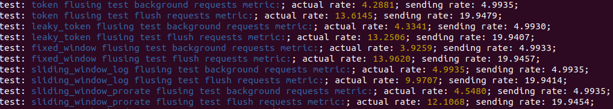

This project contains 5 rate limiter implementations with redis described in this [post](https://www.1point3acres.com/bbs/thread-503307-1-1.html).

# Project Structure
The 5 rate limiters are implemented as Python Django middleware in ratelimiter/ratelimiter_middleware.py. 

The **manual_test** folder contains a dummy app to expose rate limiters to the internet so that I can send real network requests to test it. In the dummy app, each rate limiter maps to a unique url prefix. Any request with that url prefix will go through that rate limiter and be redirected to a default index page. I also created a **manual_test_scripts.py** to automate and programmatically execute network requests test because I don't want to wear my finger to test them. :) 

This project uses *python - decouple* library to decouple secrets from main code and keep secrets locally instead of pushing them to public repository.

The requirements.txt contains all dependencies of this project. This is created from `pip3 freeze` command. 

The constants.py contains common contants shared by both rate limiters and test scripts.

# Rate Limiter Implementation
This project uses **Redis** to cache tokens and previous requests information for rate limiters. The reasons for using **Redis** are as follows:
1. **Scalability** Data stored in Redis can be accessed by multiple threads, processes and machines which enables us to control the total request rate across mulitple gateway servers. 
2. **Simplicity** Redis is basically a key-value store which both satisfies this project's needs and is easy to use.
3. **Atomicity** Multiple commands can be executed in one transaction during which no other commands from other clients can be executed. This helps to minimize risk of race conditions caused by multiple parallel clients.

There are mulitple Python Redis libraries. This project uses *redis-py* library. I didn't use Django's redis libraries because Django's redis libraries only implement Django's cache API which is too limited for this project.

This project uses Redis's LUA scripting for some rate limiter implementation. In Redis, both LUA scripting and transaction commands guarantee atomicity. The difference is that with transaction commands, a client can only get commands' returns after all commands in the atomic transaction have finished while with LUA scripting, the client can get any command's return in the middle of the atomic operation which provides more programming flexibility and power. So LUA scripting is a better option.

## 1. Token Bucket Rate Limiter
The key idea is to have n tokens for every m seconds and each request consumes 1 token. If in m seconds, all the n tokens are consumed, then all later requests will be rejected. 

I implemented this using Redis LUA scripting. The detailed algorithm is:
1. On each request, if no token have been created in previous m seconds, then create n tokens and store them in Redis. This can be achieved with Redis command `SET key n EX m NX`.
2. Decrease the number of tokens in recent m seconds. This can be achieved with `DECR` command.
3. If `DECR` return >= 0, then it still has token to be consumed. So accept and run the request.
4. Else, since `DECR` decrease the token even if it doesn't exist, it needs to check token's expiration status using `PTTR` command. If there is expiration time, then `DECR` < 0 means out of token. it should reject the request.
5. Otherwise, it should accept the request and set a new n - 1 tokens with m seconds to expire.

Since LUA script is guaranteed to be atomic, it doesn't need to worry about any race conditions caused by multiple client execution in the middle of above steps.

**Note** that in real implementation, we need to control token size n and window size m not to be too large. Because it assigns n tokens at the beginning of a window. If n is too large, there is a chance that n requests could flush into the system in a very short period of time which causes the rate to exceed the rate limit in that period of time.

## 2. Leaky Bucket Rate Limiter
This is very similar to the above token bucket rate limiter. The only difference is that this rate limiter increases the number with expiration of m seconds while token bucket rate limiter decreases the number with the expiration. Similar to token bucket rate limiter, it also has an upper limiter for the number. When the number equals to the upper limit, it will reject later requests. 

## 3. Fixed Window Rate Limiter
This rate limiter's key idea is also having n tokens in m seconds. Comparing to token bucket rate limiter, the difference is that this assigns n tokens to a fixed window of m seconds which makes the implementation simpler while sacrificing a little more memory. 

The detailed algorithm is:
1. The token key is some prefix + the beginning timestamp of the current time's m seconds fixed window. 
2. For each new request, create n tokens if not done for current time's window.
3. Then decrease the token number. Accept or reject based on the token count after decrease.

The above algorithm is implemented using Redis pipeline which executes multiple commands in one request to save network time. There is no need to use LUA scripting or transaction command to guarantee atomicity because this won't be hurted by any race condition.

## 4. Sliding Window Log Rate Limiter
The above 3 rate limiters have a common problem: For 2 consecutive m seconds windows, if n requests flush in at the last 1 second of the first m seconds window and another n requests flush in at the first 1 second of the second m seconds window, the 2n requests will all be accepted and the actual rate is 2 * rate limit which is inaccurate. 

So to make the rate limiter more accurate in the above case, I developed this sliding window log rate limiter. In this rate limiter, I log the timestamp of each accepted request. When a new request comes in, I check if there are already n requests accepted in previous m seconds (sliding window). If true, reject the new request. Else accept it. Then even in extreme flushing condition, in any m seconds, the rate would never exceed the limit. 

I can use Redis's sorted set to implement this. Each value in Redis sorted set has a score value. And the set values are sorted by score. The value of the set is a unique int generated by a counter to represent each request. The score is a request's timestamp. When a new request comes in, it removes all accepted requests outside of the m seconds sliding window. Then it checks if the set size is < n. If it is, then accept the request and add the request to the set. Else, it has reached rate limit. So reject request. 

This is also implemented in LUA scripting to avoid race condtions.

## 5. Sliding Window Prorated Rate Limiter
The above sliding window log approach consumes much more memory. To save memory while still be accurate, this rate limiter is developed. Instead of storing all request's timestamp in a sliding window, this rate limiter only stores count of requests in previous m seconds window. It assumes requests come in at a uniform speed. When a new request comes in, based on previous window’s count and current window’s count, it can calculate the estimated count from new request’s timestamp to m seconds before the timestamp which forms a sliding window. This is slightly more accurate than the first 3 rate limiters because this uses a sliding window of previous m seconds and estimates the request count in the sliding window while the first 3 rate limiters' count is based on a window whose length could vary from 0 to m seconds. 

# Test
All tests are in manual_test_scripts.py. The tests are end to end integration tests. It sends requests to the dummy app and checks the response. The test can be run from command line with command `python3 manual_test_scripts.py [verify|compare] [ratelimiter]`.

I developed 2 types of test: **Verification test** and **Comparison Test**. The verification test verifies the functionality of each rate limiter. The comparison test compares 5 rate limiters over a single metric. I also developed a test tracker to generate stats like success rate and failure rate for both types of test.

## Verification Test
This type of test verifies correctness of a rate limiter. It sends multiple requests to the dummy app and print the overall accpptance rate vs sending rate. The core function is implemented in `send_request()` function which sends a request, tracks the response and sleeps for a specific duration to achieve given sending rate. The gap between 2 requests could either be static or dynamic so that it can simulate various network requests flushing pattern. Right now I only have static requests gap tests which sends requests at a constant rate. But with current framework, dynamic requests gap tests can be quickly developed in the future. 

In the verification test framework, each single test is run 5 times. In each time, each test sends 100 requests to server and measures rates. Right now, it test 3 sending rate: 0.5 * server rate threshold; server rate threshold; 2 * server rate threshold.

## Comparison Test
To better illustrate and demonstrate the difference of accuracy and flush handling capability among the 5 rate limiters mentioned in the previous parts, I developed this test. 

In this test, there are 2 sending modes. 
1. **Background mode**: It sends requests at 0.5 * server rate threshold speed for 0 - 2 seconds.
2. **Flush mode**: It sends requests at 2 * server rate threshold speed for 1 second.

The 2 modes are staggered and repeated 100 times per rate limiter. It first generates a sequence of random background mode durations between 0 - 2 seconds. After each background mode run of 0 - 2s, it runs flush mode for 1 second. The same randomly generated duration sequence is applied to all rate limiters. Between each rate limiter's test, it rests 10 seconds to allow Redis cache data from previous rate limiter expire. 

Here is a screenshot of the test result:

My server rate threshold is 10 requests/seconds. From the result, you can see that the background mode sending rate is 5 and the flush mode sending rate is 20. **Token Bucket**, **Leaky Bucket** and **Fixed Window**'s flush mode actual success rate is around 13.5 > **Sliding Window Prorate**'s 12 > **Sliding Window Log**'s 10. This demonstrates that **Sliding Window Log** is the most accurate one. **Sliding Window Prorate** is the second accurate one. And the other three are similar and least accurate.

# Other Approaches
This project mainly implements the rate limiters mentioned in the post. There are also many other types of rate limiters like [Guava's rate limiter](https://github.com/google/guava/blob/master/guava/src/com/google/common/util/concurrent/RateLimiter.java). Guava's rate limiter issues a token at a time and queues requests up for future tokens. In my 5 rate limiters implementations, I didn't use any queue. The queue approach is like issueing future tokens to current requests. It is also very similar to **Token Bucket** approach assigning a large number of tokens at a time. The only difference is that queue approach uses a local queue while **Token Bucket** approach relies on low level thread library queue or operating system queue which may consume more system resources. 

